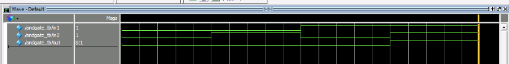
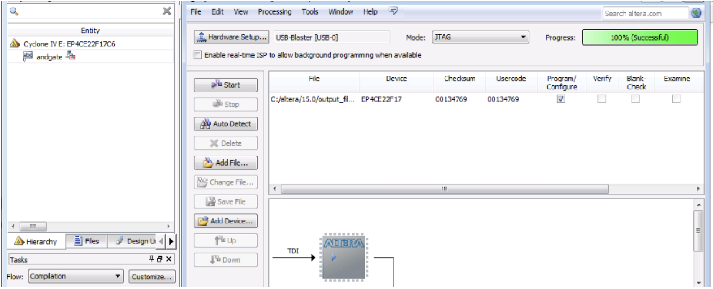
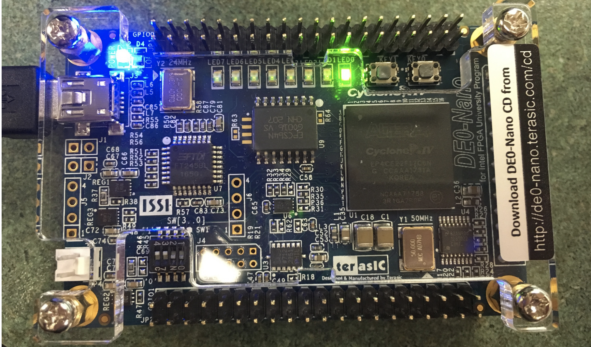
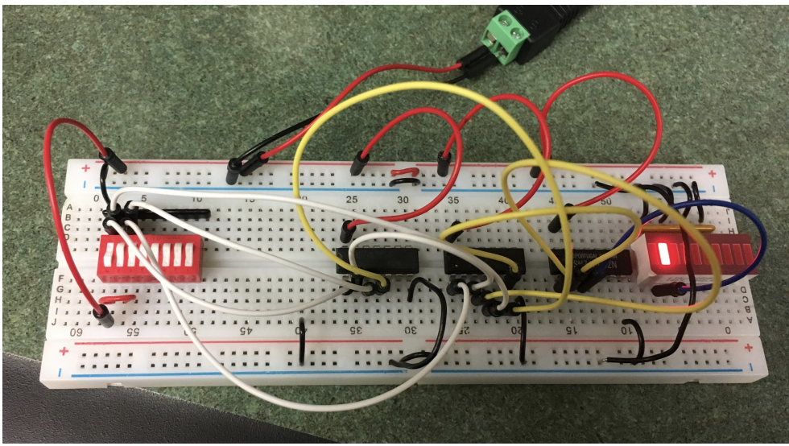
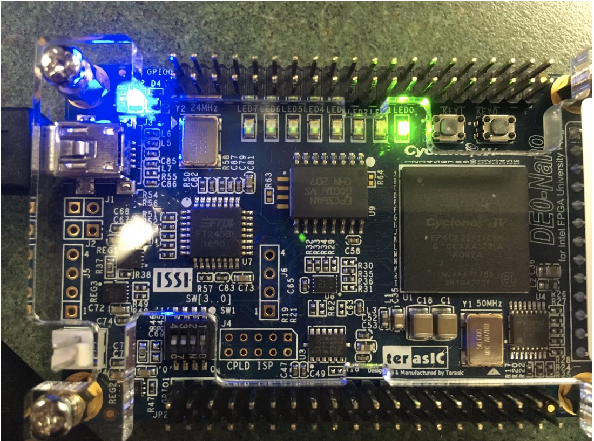
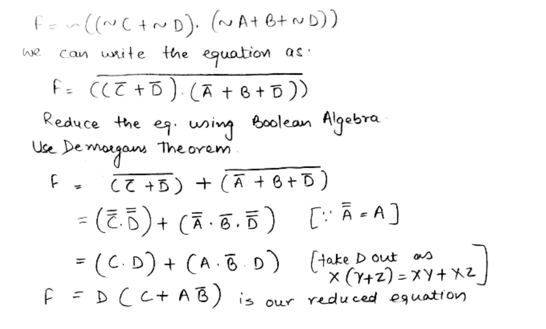
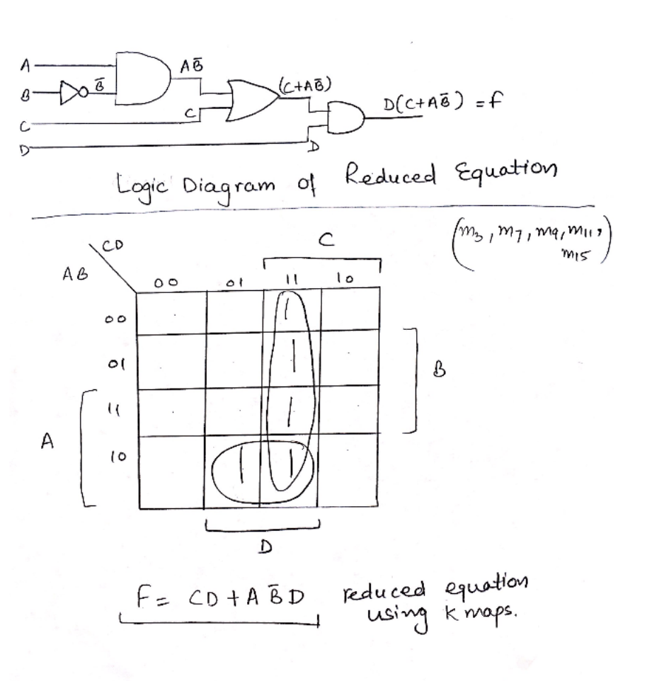
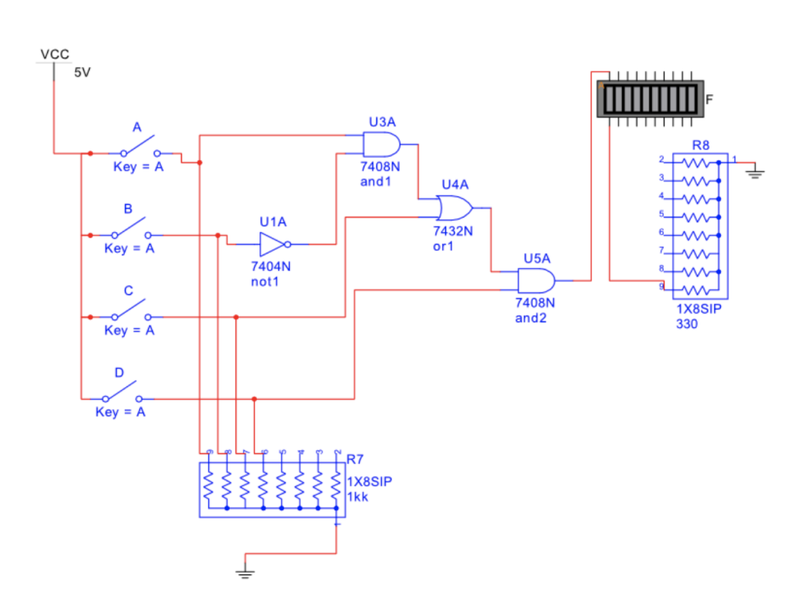

## Part 1: IDE Tutorial and Basic 74XX gates on FPGA

Get Familiar with Altera-Quartus IDE. Designed and verified the Basic Gates in Verilog and checked their working on Terasic DE0 Nano Board. 
Create a Verilog hardware description for the 7408 AND gate, 7432 OR gate, 7404 NOT and 7400 NAND gate. Generate Testbenches and generate waveform. Make them run on FPGA Board. 

### AND Gate

The following waveform is generated:

The design is suceesfully implemented on FPGA using Quartus.

The following Result is seen on FPGA when both inputs are 1. 

Similarly all the gates are verified.

## Part 2: Exclusive OR gate

Built the Exclusive OR gates with the 74XX gates and FPGA.

Breadboard circuit	for	XOR	gate showing Input (0	1) and	Output	(1):

XOR implementation on FPGA with input (0 1) and Output (1):

## Part 3: 

Consider a circuit with 4 inputs A, B, C, and D and one output F. Input A should be the most significant bit. Create a truth table to implement the equation below. Show all the work (Boolean Algebra) as part of the design to reduce the equation for F. Draw the logic diagram (with names of internal and external signals) for your final reduced equation. After completing your logic diagram, write the Verilog description using “Structural Modeling”. Compile, download and test your design against the truth table you made from the original equation below.

F = /((/C + /D) · (/A + B + /D)) ←(using standard AND OR NOT symbols)

Multisim simulation of the design is:

